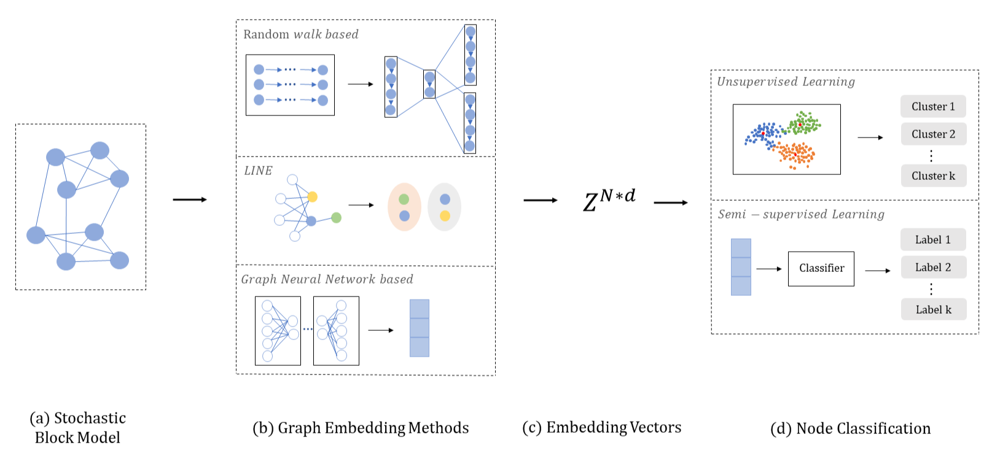

Hello everyone! I am a first-year Ph.D. student in Computer Science at Arizona State University (ASU), working under the supervision of Professor [Hua Wei](https://www.public.asu.edu/~hwei27/index.html). Previously, I obtained my Bachelor's degree from Beijing Jiaotong University and my Master's degree in Computer Science from the University of British Columbia (UBC), Okanagan Campus, under the guidance of Professor [Yong Gao](https://cmps-people.ok.ubc.ca/yongg/).

I am still in the process of exploring my research direction. My current interests lie in the Trustworthy Graph Neural Networks and various graph-based applications. If you have similar research interests, I’d be happy to connect and discuss ideas!

Research Interests
======

- Trustworthy Graph Neural Networks
- Graph-Based Applications

Master Thesis: The Effectiveness of GNNs for Node Classification: The Significance of Side Information
======
This thesis studies the effectiveness of Graph Neural Networks (GNNs) for node classification. We conduct systematic experiments on several representative deep-learning models for graph data, using training data generated from the Stochastic Block Model (SBM) and the theoretical results on the fundamental limits of this model as guidance in the design of our experiments.

We observe that GNN-based methods fail to exploit the information from labeled nodes in semi-supervised learning settings.  We propose an effective data augmentation method to enhance GNN-based methods by making better use of labeled information in the training data.  Our experiments using synthetic data from SBMs and real-world datasets demonstrate that our method can significantly enhance the capabilities of GNN models and notably improve their performance for node classification. 

